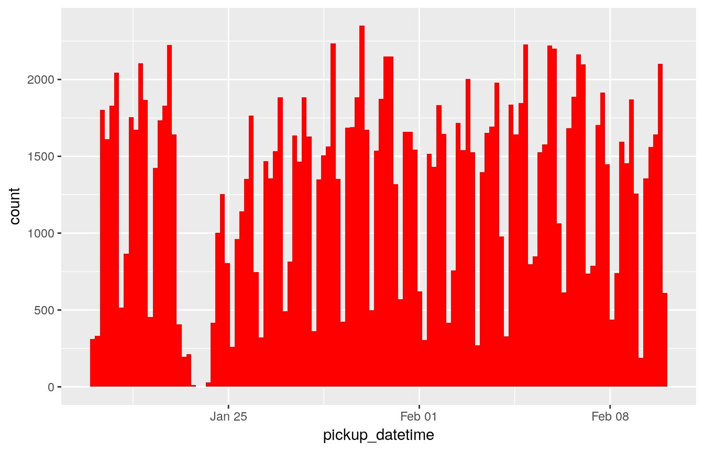
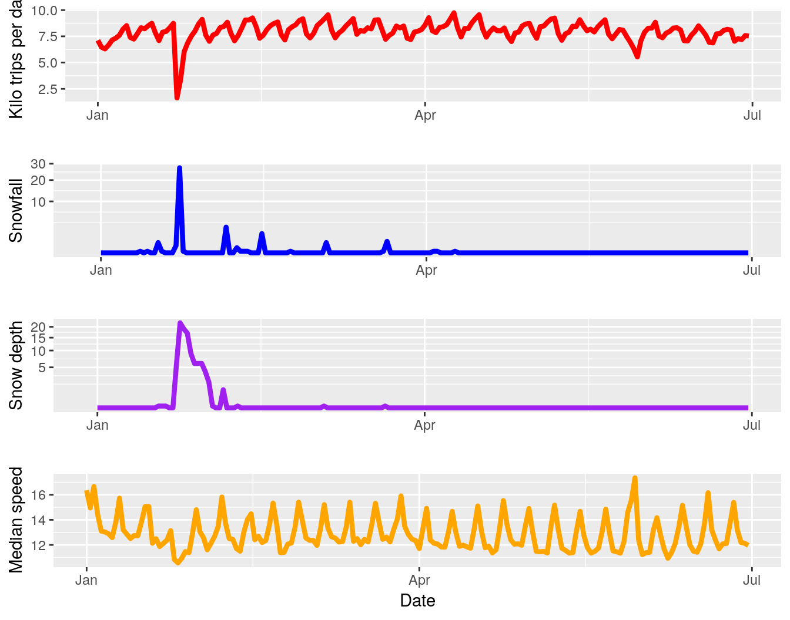
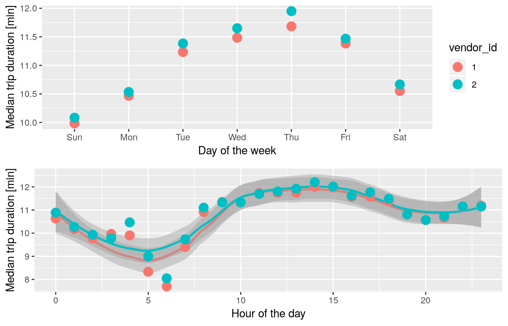
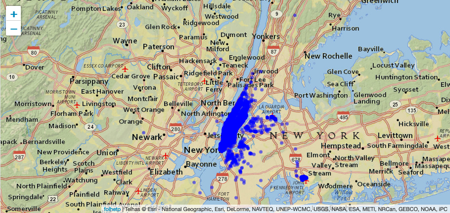

```{r setup, include=FALSE}
knitr::opts_chunk$set(echo = FALSE, message=FALSE, warning=FALSE)
```

```{r definition}
library('ggplot2') # visualisation
library('scales') # visualisation
library('grid') # visualisation
library('RColorBrewer') # visualisation
library('corrplot') # visualisation
library('alluvial') # visualisation
library('dplyr') # data manipulation
library('readr') # input/output
library('data.table') # data manipulation
library('tibble') # data wrangling
library('tidyr') # data wrangling
library('stringr') # string manipulation
library('forcats') # factor manipulation
library('lubridate') # date and time
library('geosphere') # geospatial locations
library('leaflet') # maps
library('leaflet.extras') # maps
library('maps') # maps
library('xgboost') # modelling
library('caret') # modelling
```

## Explicação do problema

Queremos examinar quais fatores contribuem para períodos de viagem mais curtos ou mais longos nas viagens de táxi em Nova York.

## Insights

### Queda nas corridas em um determinado período

Foi identificado uma queda nas corridas entre os meses de Janeiro e Fevereiro, uma possível causa seja o inverno em Nova York.



Obtendo os dados dos boletins meteorológicos do período em questão, podemos comparar as estatísticas de queda de neve com os números de nossas viagens por dia.



### Data e hora da corrida VS duração


Como podemos ver no gráfico acima, entre terça e sexta-feira são os dias com mais duração de tempo, e esse padrão é similar para os dois vendor_id.
No gráfico seguinte, ao longo do dia encontramos um pico no início da tarde.

### Visualizando características individuais



Ponto interessante aqui foi a análise dos dados de uma outra pespectiva, no caso em um mapa. Analisando a imagem percebemos que quase todas as viagens foram de fato feitas apenas em Manhattan. Outro ponto notável é o aeroporto JFK para o sul-leste da cidade.

## Novos comandos

Similar ao 'read.table' só que mais rápido

```{r, echo=TRUE}
fread('./data/train.csv') %>%
  summary()
```

Exibe um mapa interativo
```{r,echo=TRUE}
leaflet() %>% 
  addProviderTiles("Esri.NatGeoWorldMap")
```